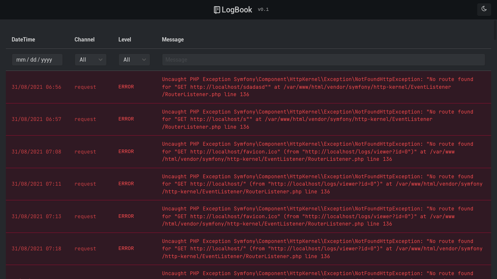

<h1 align="center">LogBook Symfony Bundle <small>v0.1</small></h1>

<p align="center">
<a href="https://github.com/proycer/logbook-symfony-bundle"></a>
<a href="https://github.com/proycer/logbook-symfony-bundle"></a>
<a href="https://github.com/laravel/framework/actions"></a>
</p>



LogBook is a centralized web viewer for monolog logs files. 
It allows you to list and view logs from local and external project, in one easy place with highlighting and level and channel filtering.

## Installation
Install the package with:
```console
composer require proycer/logbook-symfony-bundle
```
##  Two-step Configuration

Create the routes yaml file `config/routes/log_book.yaml`

```yaml
log_book:
  resource: '@LogBookBundle/Resources/config/routes.xml'
  prefix: '/logs'
```
Create the config yaml file `config/packages/log_book.yaml`
```yaml
# List of log files to show
log_book:
    log_files:
        # Unique identifier for the logfile
        somelog1:
            # Use full path
            path: 'Some/Full/Path/to/Log/File.Ext'

            # Pretty name to display else file name
            name: My Log Files Pretty Name 

            # (Optional) Number of days to pull from log. See ddtraceweb/monolog-parser.
            days: 0

            # (Optional) See ddtraceweb/monolog-parser for patterns.
            pattern: null

            # (Optional) PHP style date format of log file
            date_format: 'Y-m-d\TH:i:s.uP'
            
            # (Optional) Log level spelling. Case sensitive
            levels:
                debug: DEBUG
                info: INFO
                notice: NOTICE
                warning: WARNING
                error: ERROR
                alert: ALERT
                critical: CRITICAL
                emergency: EMERGENCY

        somelog2:
            path: '/path/to/logfile.log'
            name: Pretty Logfile Name

    # Show App logs in var/log
    show_app_logs: true
```
## Advanced Configuration

### pattern
The default pattern is `'/\[(?P<date>.*)\] (?P<logger>\w+).(?P<level>\w+): (?P<message>[^\[\{].*[\]\}])/'`
\
You can change the regex pattern to match your log file but the pattern must include `P<date>`, `P<logger>`, `P<level>`, and `P<message>` as regex groups.
\
Example `'/\[(?P<date>.+)\] (?P<logger>\w+).(?P<level>\w+): (?P<message>.*)/'`


### days
Setting days in the config to 0 will parse to whole log which is the default. Days set to 5 for example will parse the log until the date portion of the pattern
if greater than DateTime('now') minus 5 days.

### date_format
This should be the php date format of the date portion of the pattern. Default is Y-m-d\TH:i:s.uP
/
[PHP DateFormat](https://www.php.net/manual/en/function.date.php)

### levels
Override the default spelling for each level. e.g. WARNING -> WARN

## Roadmap

- [x] Improve UX/UI
- [x] Live searching and filters
- [x] Update to PHP 8
- [ ] Automate installation
- [ ] Show advance traceback
- [ ] Improve logs loading (as json)
- [ ] Improve searching and filter

## Thanks
- [monolog/monolog](https://github.com/Seldaek/monolog)
- [ddtraceweb/monolog-parser](https://github.com/ddtraceweb/monolog-parser)
- [evotodi/log-viewer-bundle](https://github.com/evotodi/log-viewer-bundle)
- [Halfmoon front-end framework](https://www.gethalfmoon.com/)
- [Tabler icons](https://tabler-icons.io/)
- [JetBrains Mono Font](https://fonts.google.com/specimen/JetBrains+Mono)
- [Dayjs plugin](https://github.com/iamkun/dayjs)

## Contributions
Contributions are very welcome! 

Please create detailed issues and PRs.  

## License

This package is free software distributed under the terms of the [MIT license](LICENSE).